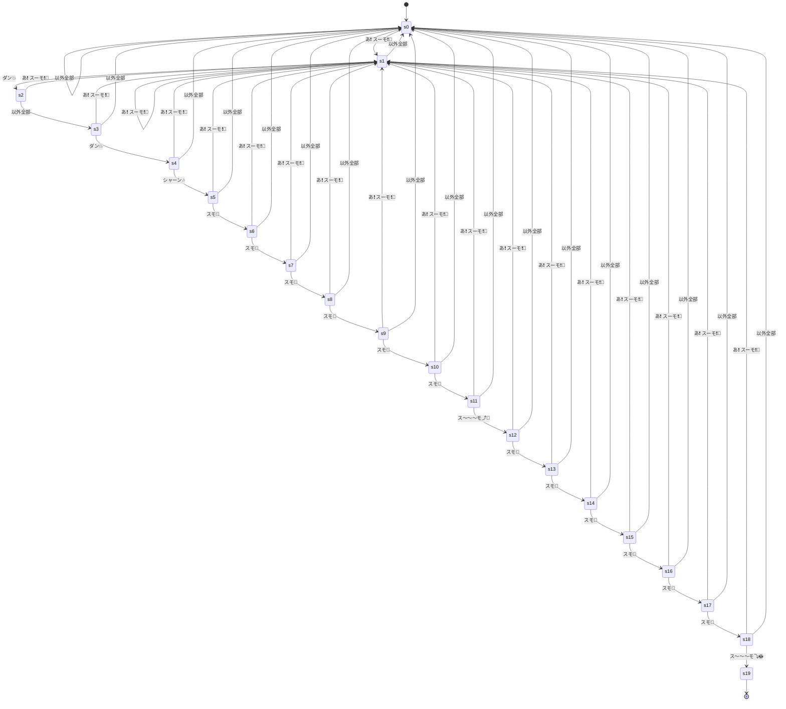

# スーモ状態遷移

## ルール

以下の要素をランダムに出力する

- あ❗️ スーモ❗️🌚
- ダン💥
- シャーン🎶
- スモ🌝
- スモ🌚
- ス〜〜〜モ⤴🌝
- ス〜〜〜モ⤵🌞

「あ❗️ スーモ❗️🌚ダン💥ダン💥ダン💥シャーン🎶スモ🌝スモ🌚スモ🌝スモ🌚スモ🌝スモ🌚ス〜〜〜モ⤴🌝スモ🌚スモ🌝スモ🌚スモ🌝スモ🌚スモ🌝ス〜〜〜モ⤵🌞」が連続して出力されたときに終了する

## 状態遷移図

